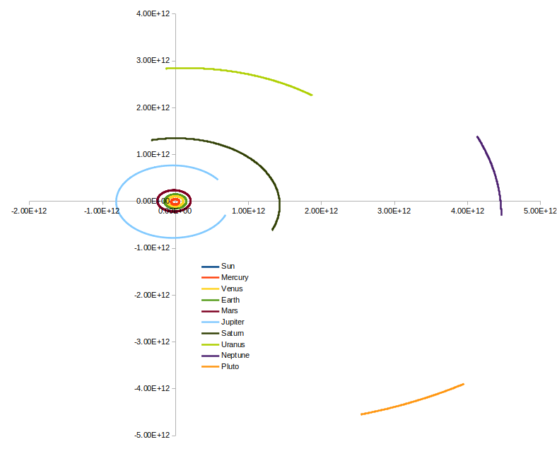

# Solar System Calculator

## Overview

It was Friday evening and I wanted to play with planetary orbits.

I retrieved the evenings orbital ephemeris for the key solar system bodies and ran the system forwards in time with a Runge-Kutta solver for a total of 10 years. The main function requests the solver increments hourly, targetting each 24 hour period. This takes about 20 seconds on my mid-spec laptop.

Orbital ephemeris were retrieved from NASA/JPL's [Horizons System](https://ssd.jpl.nasa.gov/horizons).

## Output

The code outputs a numeric table. Plotting this data with a spreadsheet we get:

## Future plans

At some point I'd like to write a parser for the code output to plot the results, and possibly animate planetary movement.
